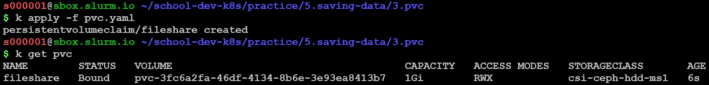
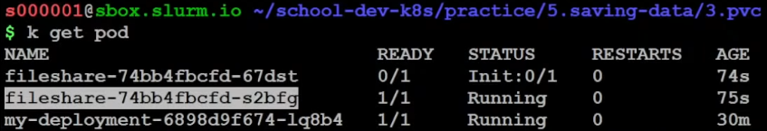

# Урок 5: Хранение данных. Вечерняя школа «Kubernetes для разработчиков» [youtube](https://youtu.be/8Wk1iI8mMrw)

## Техническая пауза, опрос [00:00:20](https://youtu.be/8Wk1iI8mMrw?t=20)

## Вступление [00:04:15](https://youtu.be/8Wk1iI8mMrw?t=255)
- Сергей приводит в пример новичков, которые развернув "Hello World!" приложение в kubernetes радуются его неубиваемости и пробуют добавить в деплоймент образ какого нибудь MySQL, получают 3 отдельных базы а не какой-то кластер и спрашивают, почему так происходит.
- Происходит это потому, что kubernetes не знает ничего о базах данных и не умеет их "готовить"
- Зато kubernetes умеет предоставлять приложению место, где оно сможет хранить свои данные

## Хранение данных [00:06:48](https://youtu.be/8Wk1iI8mMrw?t=408)
- В kubernetes работает принцип good state - dead state (statless)
- Kubernetes изначально разрабатывался и предназначался для запуска микросервисов
    - Микросервисы, как правило, маленькие, быстрые, потребляющие мало ресурсов, их можно запускать в нужное количество реплик и вся нагрузка будет более или менее равномерно распределяться по всем репликам, отказ небольшой части реплик практически не скажется на работе сервиса, упавшие реплики будут восстановлены
- С приложениями, которые хранят состояние (state), вышеописанный подход не работает в полной мере, т.к. мы будем получать уникальные реплики
    - Например, приложение обслуживает бэкэнд личного кабинета и хранит состояние залогинившихся пользователей, если какая-то реплика умрёт, то пользователи, которых она обслуживала, вылетят из ЛК и им будет необходимо снова залогиниться
- Таким образом, хранить состояние внутри реплики - это плохая идея, есть более подходящие варианты:
    - Данные стоит хранить в базе данных
    - Данные, к которым нужен оперативный доступ стоит хранить в соответствующих решениях, например memcached, redis, tarantool и т.п.
    - Для файлов стоит использовать, например, S3-совместимое хранилище ([1](https://en.wikipedia.org/wiki/Amazon_S3), [2](https://habr.com/ru/post/318086/))
        - Хороший S3 может работать как CDN, например, вы загрузили в S3 файлик, отдали пользователю ссылку и пользователь сможет получить файл по этой ссылке прямо из S3 мимо основного бэкэнда
- Если всё таки очень хочется хранить состояние в репликах, то есть несколько способов, о них ниже

### HostPath [00:09:29](https://youtu.be/8Wk1iI8mMrw?t=569)
- Начнём разбирать с тома (volume), под названием HostPath
    - Когда на прошлых занятиях мы работали с ConfigMap, Secrets, мы их монтировали как файлы внутрь контейнера, мы столкнулись с двумя понятиями:
        - volumeMounts - точки монтирования внутри контейнера
        - volumes - тома, которые мы монтируем в эти точки
    - С томами, на которых можно хранить данные, всё работает так же:
        - у нас будет точка монтирования, volumeMount, где мы укажем, куда монтировать наш том
        - в разделе volumes мы будем указывать тип тома, в нашем случае это hostPath
- HostPath - аналог механизма из docker compose - мы берем каталог, который находится на ноде и монтируем этот каталог внутрь контейнера, таким образом приложение внутри контейнера получает доступ к каталогу, который находится на ноде
    - Вопрос в зрительский зал - насколько это хорошо с точки зрения безопасности?
        - Общее настроение - вариант плохой
    - Почему это плохой вариант?
        - Потому что такой механизм позволяет получить доступ к каталогам на уровне ноды, в некоторых сценариях этим могут воспользоваться злоумышленники, получившие доступ к контейнеру
            - В связи с этим в продакшн кластерах часто запрещают к использованию данный тип томов с помощью политик безопасности (pod security policy) или с помощью внешних валидаторов манифестов типа [gatekeeper](https://kubernetes.io/blog/2019/08/06/opa-gatekeeper-policy-and-governance-for-kubernetes/), [kubeval](https://kubeval.instrumenta.dev/)

#### Посмотрим, как это выглядит в yaml манифестах [00:12:25](https://youtu.be/8Wk1iI8mMrw?t=745)
- работаем в каталоге `~/school-dev-k8s/practice/5.saving-data/1.hostpath`
- смотрим содержимое манифеста деплоймента
```yaml
# deployment.yaml
---
apiVersion: apps/v1
kind: Deployment
metadata:
  name: my-deployment
spec:
  replicas: 1
  selector:
    matchLabels:
      app: my-app
  strategy:
    rollingUpdate:
      maxSurge: 1
      maxUnavailable: 1
    type: RollingUpdate
  template:
    metadata:
      labels:
        app: my-app
    spec:
      containers:
      - image: quay.io/testing-farm/nginx:1.12
        name: nginx
        ports:
        - containerPort: 80
        resources:
          requests:
            cpu: 10m
            memory: 100Mi
          limits:
            cpu: 100m
            memory: 100Mi
        volumeMounts:         # раздел для указание точек монтирования
        - name: data          # имя тома
          mountPath: /files   # путь к точке монтирования (внутри пода)
      volumes:              # перечисление томов, которые будут смонитированы
      - name: data          # имя тома
        hostPath:           # тип тома
          path: /data_pod   # путь к каталогу (внутри узла)
...
```
- применяем деплоймент
```shell
$ kubectl apply -f deployment.yaml

deployment.apps/my-deployment created

$ kubectl get pod

No resources found in s024713 namespace.

$ kubectl get all

NAME                            READY   UP-TO-DATE   AVAILABLE   AGE
deployment.apps/my-deployment   0/1     0            0           64s

NAME                                      DESIRED   CURRENT   READY   AGE
replicaset.apps/my-deployment-f9c7845d9   1         0         0       64s
```
- видим, что что-то пошло не так - деплоймент создан, поды не появились, репликасет не перешёл в статус READY
- разбираемся
```shell
$ kubectl describe deployments.apps my-deployment

# часть вывода скрыта
# видим, что есть проблемы, но что именно не так, не понятно
Conditions:
  Type             Status  Reason
  ----             ------  ------
  Progressing      True    NewReplicaSetCreated
  Available        True    MinimumReplicasAvailable
  ReplicaFailure   True    FailedCreate
OldReplicaSets:    <none>
NewReplicaSet:     my-deployment-f9c7845d9 (0/1 replicas created)
Events:
  Type    Reason             Age    From                   Message
  ----    ------             ----   ----                   -------
  Normal  ScalingReplicaSet  4m10s  deployment-controller  Scaled up replica set my-deployment-f9c7845d9 to 1

$kubectl describe replicasets.apps my-deployment-f9c7845d9

# часть вывода скрыта
# видим сообщение от replicaset-controller о том что hostPath запрещён к использованию посредством PodSecurityPolicy
Conditions:
  Type             Status  Reason
  ----             ------  ------
  ReplicaFailure   True    FailedCreate
Events:
  Type     Reason        Age                     From                   Message
  ----     ------        ----                    ----                   -------
  Warning  FailedCreate  3m43s (x17 over 9m14s)  replicaset-controller  Error creating: pods "my-deployment-f9c7845d9-" is forbidden: PodSecurityPolicy: unable to admit pod: [spec.volumes[0]: Invalid value: "hostPath": hostPath volumes are not allowed to be used]
```

#### Q&A
- [01:16:23](https://youtu.be/8Wk1iI8mMrw?t=983)
    - Q: На какой ноде будет лежать каталог HostPath
    - A: Будет происходить попытка смонтировать каталог с той ноды, где запущен под
- [01:16:42](https://youtu.be/8Wk1iI8mMrw?t=1002)
    - Q:  Где управлять PodSecurityPolicy?
    - A: Рассмотрим позже, это отдельная трехчасовая лекция, эта тема есть в курсе "Мега", но здесь тоже будет обзорная лекция
- [01:17:03](https://youtu.be/8Wk1iI8mMrw?t=1023)
    - Q: По умолчанию все политики открыты?
    - A: Да, по умолчанию никаких psp не включено в kubernetes, их нужно специально включать для того чтобы можно было применять какие либо ограничения
- [00:17:12](https://youtu.be/8Wk1iI8mMrw?t=1032)
    - Q: Кажется, это ответ на эту ссылку ([PodSecurityPolicy Deprecation: Past, Present, and Future](https://kubernetes.io/blog/2021/04/06/podsecuritypolicy-deprecation-past-present-and-future/)), но она была воспринята как информация о прекращении поддержки hostPath
    - A: Такой тип в deprecated перейти не может, потому что он нужен для системных компонентов kubernetes, чтобы они запускались. Там решается проблема курицы и яйца, Мюнгхаузена, который вытаскивает себя из болота и т.д., грубо говоря, ему (кому?) нужно запуститься, пока еще не все компоненты запущены, поэтому приходится использовать hostPath для таких решений

### [EmptyDir](https://kubernetes.io/docs/concepts/storage/volumes/#emptydir) [00:17:47](https://youtu.be/8Wk1iI8mMrw?t=1067)
- Еще один вариант тома, т.н. [Ephemeral](https://kubernetes.io/docs/concepts/storage/ephemeral-volumes/)
- В перводе с английского - пустой каталог
- Создаёт временный диск и монтирует его внутрь контейнера
- Т.е., это не заранее обозначенный каталог на ноде, а специальный каталог, создаваемый посредством container runtime interface, который будет использоваться в нашем контейнере всё время, пока живёт под
- После того, как под закончит свою работу (его выключат, обновят и т.п.), emptyDir будет удалён вместе с подом
- Таким образом, данные хранимые в emptyDir живут столько же, сколько и под, удалён под - удалены данные
- Если контейнер внутри пода упадёт, сохранность данных это не затронет
- Можно провести аналогию emptyDir со стандартным docker volume, при условии, что в манифесте docker compose мы не указываем, какой каталог монтировать, но указываем имя, будет создан volume, с тем отличием, что emptyDir будет удален при завершении работы пода

#### Зачем нужен EmptyDir? [00:19:23](https://youtu.be/8Wk1iI8mMrw?t=1163)
- emptyDir применяется для работы с данными, которые не имеет смысл хранить постоянно, например:
    - для временных баз данных, например для автотестов
    - при тестировании приложений и сервисов, требующих работы с диском

##### Пробуем применить EmptyDir в учебном кластере [00:20:50](https://youtu.be/8Wk1iI8mMrw?t=1250)
- Переходим в каталог `~/school-dev-k8s/practice/5.saving-data/2.emptydir`, видим манифест:
```yaml
# deployment.yaml
---
apiVersion: apps/v1
kind: Deployment
metadata:
  name: my-deployment
spec:
  replicas: 1
  selector:
    matchLabels:
      app: my-app
  strategy:
    rollingUpdate:
      maxSurge: 1
      maxUnavailable: 1
    type: RollingUpdate
  template:
    metadata:
      labels:
        app: my-app
    spec:
      containers:
      - image: quay.io/testing-farm/nginx:1.12
        name: nginx
        ports:
        - containerPort: 80
        resources:
          requests:
            cpu: 10m
            memory: 100Mi
          limits:
            cpu: 100m
            memory: 100Mi
        volumeMounts:       
        - name: data
          mountPath: /files
      volumes:          # перечисление томов, которые будут смонитированы
      - name: data      # имя тома
        emptyDir: {}    # тип тома и пустой словарь в качестве значения, чтобы манифест прошел валидацию
...
```
- Видим знакомую картину, в разделе volumes подключаем том типа emptyDir
- Фигурные скобки в качестве значения переданы для того чтобы манифест прошел валидацию (непонятно только чью, попробовал убрать их, ошибок не встретил, подставил вместо них `~` - аналогично)
- Далее Сергей применяет манифест и демонстрирует, что мы можем писать в каталог /files, а также что после перезахода в контейнер, он остаётся на месте

#### Q&A
- [00:24:43](https://youtu.be/8Wk1iI8mMrw?t=1483)
    - Q: Ограничения на размер emptyDir?
    - A: Такие же как на том, где фактически расположен emptyDir, обычно это каталог  `/var/lib/kubelet/pods/_POD_ID_/volumes/kubernetes.io~empty-dir` или оперативная память
- [00:25:18](https://youtu.be/8Wk1iI8mMrw?t=1518)
    - Q: Можно ли создать emptyDir для нескольких подов?
    - A: Можно, но для каждого пода это будет отдельный emptyDir
- [00:25:30](https://youtu.be/8Wk1iI8mMrw?t=1530)
    - Q: А если apply - тоже пропадёт emptyDir?
    - A: Если произошли изменения, которые привели к созданию новых подов, то, как следствие, emptyDir пропадёт
- [00:25:57](https://youtu.be/8Wk1iI8mMrw?t=1557)
    - Q: Какой смысл использовать emptyDir, если можно положить данные в любую папку в контейнере и они так же не сохранятся при удалении пода
    - A: 
        - В связи со "слоёной" системой устройства хранилища в докер контейнере мы имеем большой оверхед по производительности, поэтому для работы используют механизм монтирования томов
        - Коллега подсказывают, что для обмена данными между разными контейнерами внутри одного пода тоже могут применяться emptyDir

### PV/PVC/Storage class [00:27:32](https://youtu.be/8Wk1iI8mMrw?t=1652)
- Если кратко - более современные абстракции для работы с томами, подробнее в видео
- [Документация по Persistent Volumes](https://kubernetes.io/docs/concepts/storage/persistent-volumes/)

#### PVC, persistentVolumeClaim [00:29:20](https://youtu.be/8Wk1iI8mMrw?t=1760)
- Это наша заявка на то, какой диск нам нужен [00:33:15](https://youtu.be/8Wk1iI8mMrw?t=1995)
```yaml
# пример описания подключения такого тома к поду
volumes:                    # раздел объявления томов
  - name: mypd              # задаём имя
    persistentVolumeClaim:  # указываем тип тома
      claimName: myclaim    # название клэйма
```
- [00:29:43](https://youtu.be/8Wk1iI8mMrw?t=1783) - как это всё устроено
- [00:30:31](https://youtu.be/8Wk1iI8mMrw?t=1831) - обзор типов доступа к диску, то же в [документации](https://kubernetes.io/docs/concepts/storage/persistent-volumes/#access-modes)

#### [Storage class](https://kubernetes.io/docs/concepts/storage/storage-classes/) [00:31:24](https://youtu.be/8Wk1iI8mMrw?t=1884)
- В kubernetes для хранения данных используются внешние системы хранения данных, такие как:
    - [Ceph](https://ceph.io/en/)
    - [Gluster](https://www.gluster.org/)
    - [LINSTOR](https://linbit.com/linstor/)
    - Различные аппаратные решения
    - Облачные решения - gcp, aws
- Storage class - это третий параметр, который учитывается в PVC
- В storage class мы можем описать подключение к таким системам и указать данные для подключения, такие как:
    - адреса
    - логины/пароли/токены
    - различные другие настройки для взаимодействия с СХД

#### Persistent Volume [00:33:24](https://youtu.be/8Wk1iI8mMrw?t=2004)
- Абстракция, которая создаётся и в которой записывается информация о том диске, который был выдан нашему приложению, в PVC заявка, в PV хранится информация о том, какой диск в СХД был выдан нашему приложению, как правило, там ID диска хранится, или что-то подобное, например адрес. Storage class - это информация для kubernetes для получения диска, адрес API, креды и т.п.
- Откуда берутся PV? [00:34:47](https://youtu.be/8Wk1iI8mMrw?t=2087)
    - Самый простой вариант - системный администратор СХД руками создаёт диски и с данными этих дисков создаёт манифесты PV в kubernetes. Таким образом формируется список свободных PV в kubernetes, который описывает какие-то диски в СХД
    - Второй вариант - это использование PV Provisioner (см. ниже)

#### Пример монтирования PV в под [00:35:29](https://youtu.be/8Wk1iI8mMrw?t=2129)
- Имеем набор PV:
    - NFS PV 1 50GB
    - NFS PV 2 100GB
    - RBD PV 3 100GB (3)
- PVС на диск в 50GB, storageClass'а NFS
- Pod, с описанием тома типа PVC с именем, указанным в предыдущем пункте

- Что произойдёт при применении манифестов:
    - PVC отработает и подключит к ноде диск в 50GB, переведя это PV в состояние BOUND, связанный с нашим PVC
    - К поду будет подключен наш PV
        - Грубо говоря, СХД подключается к диску ноды, где запущен наш под, данные прокидываются в контейнер, приложение начинает работать, kubernetes у себя записывает, что первый том (NFS PV 1 50GB) был занят (BOUND) таким-то подом, после этого его никто не сможет использовать, приложение его заняло, с ним работают, PV имеет статус BOUND

- К исходным данным добавляется еще один PVС на диск в 50GB, storageClass'а NFS и запрашивающий его под
- После применения манифеста будет выдан PV 2, т.к. он удовлетворяет нашему запросу, не важно что он больше чем нужно
- Происходит аналогичная история, PV 2 становится BOUND, диск подключается по той же схеме к другому поду
- Из 100GB места на PV 50GB места будут незадействованы
- Такая ситуация типична, бывают случаи, когда на запросы небольшие, а PV нарезаны неудачным образом и на PVC небольшого объема выдаётся огромный PV. Во избежание таких ситуаций используют механизм PV Provisioner


#### PV Provisioner [00:39:09](https://youtu.be/8Wk1iI8mMrw?t=2349)
- Если у нас нет свободных PV, но есть PVC, они будут висеть в состоянии PENDING, т.е. ждать, пока появятся PV, которые удовлетворяют запросу (PVC) - пока проснётся админ, нарежет СХД на PV, напишет и применит манифесты для подключения PV в kubernetes и только после этого приложение сможет запуститься
- Чтобы не заниматься ручной нарезкой хранилищ на PV, придумали PV Provisioner
- Это такая программа, которая ходит в облако или СХД, нарезает PV и создаёт нужные манифесты, причем диски создаются в соответствии запросам PVC
- Таким образом мы получаем полную автоматизацию и целевое расходование дискового пространства

#### Манифесты, с которыми будем работать
 - Всё в каталоге `~/school-dev-k8s/practice/5.saving-data/3.pvc`
 
##### PVC [00:41:27](https://youtu.be/8Wk1iI8mMrw?t=2487)
```yaml
# pvc.yaml
---
kind: PersistentVolumeClaim
apiVersion: v1
metadata:
  name: fileshare # Имя PVC
spec:
  storageClassName: csi-ceph-hdd-ms1 # Имя класса, оно формируется отдельно администратором
  accessModes:
  - ReadWriteMany # Режим работы с диском, ниже будет об этом
  resources:
    requests:
      storage: 10Mi # Запрашиваем диск размером в 10 мегабайт (если точнее - мебибайт, см. ниже в вопросах)
```
- storageClassName можно не указывать, если в кластере создан и задан storageClass по умолчанию

##### ConfigMap [00:43:42](https://youtu.be/8Wk1iI8mMrw?t=2622)
```yaml
# configmap.yaml
---
apiVersion: v1
kind: ConfigMap
metadata:
  name: fileshare
data:
  default.conf: |
    server {
      listen       80 default_server;
      server_name  _;
      default_type text/plain;
      location / {
        return 200 '$hostname\n';
      }
      location /files {
        alias /data;
        autoindex on;
        client_body_temp_path /tmp;
        dav_methods PUT DELETE MKCOL COPY MOVE;
        create_full_put_path on;
        dav_access user:rw group:rw all:r;
      }
    }
```

##### Deployment [00:44:16](https://youtu.be/8Wk1iI8mMrw?t=2656)
```yaml
# deployment.yaml
---
apiVersion: apps/v1
kind: Deployment
metadata:
  name: fileshare
spec:
  replicas: 2
  selector:
    matchLabels:
      app: fileshare
  strategy:
    rollingUpdate:
      maxSurge: 1
      maxUnavailable: 1
    type: RollingUpdate
  template:
    metadata:
      labels:
        app: fileshare
    spec:
      initContainers:
      - image: busybox
        name: mount-permissions-fix
        command: ["sh", "-c", "chmod 777 /data"]
        volumeMounts:
        - name: data
          mountPath: /data
      containers:
      - image: centosadmin/reloadable-nginx:1.12
        name: nginx
        ports:
        - containerPort: 80
        resources:
          requests:
            cpu: 10m
            memory: 100Mi
          limits:
            cpu: 100m
            memory: 100Mi
        volumeMounts:
        - name: config
          mountPath: /etc/nginx/conf.d
        - name: data
          mountPath: /data
      volumes:
      - name: config
        configMap:
          name: fileshare
      - name: data
        persistentVolumeClaim:
          claimName: fileshare
```
- Немного грустного - в учебном кластере воспроизвести эксперименты с данными манифестами не получится [00:45:52](https://youtu.be/8Wk1iI8mMrw?t=2752)

##### Работаем в консоли
- Применяем манифест PVC [00:49:17](https://youtu.be/8Wk1iI8mMrw?t=2957)

- Видим что создался PVC с именем fileshare, с состоянием Bound
- Иногда состояние может быть Pending, т.к. монтирования диска происходит не мгновенно, иногда это может занимать несколько секунд, много зависит от скорости СХД
- В столбце VOLUME мы видим имя объекта PVC, созданного провижинером под нас
- CAPACITY (размер) - 1Gi, хотя мы просили 10Mi, это зависит от настроек провижинера, видимо в нашем случае минимальный размер составляет 1Gi
- Смотрим вывод k get pv [00:50:50](https://youtu.be/8Wk1iI8mMrw?t=3050)
```shell
NAME                                      CAPACITY  ACCESS MODES  RECLAIM POLICY  STATUS    CLAIM                             STORAGECLASS             REASON  AGE 
pvc-3fc6a2fa-46df-4134-8b6e-3e93ea8413b7  10Gi      RWX           Delete          Bound     s000001/fileshare                 csi-ceph-hdd-ms1                 4d2h
pvc-59a16cc0-d96c-4760-afa3-1c12e255743c  1Gi       RWO           Delete          Bound     prometheus-monitoring/alertmana~  csi-ceph-hdd-ms1                 15d 
pvc-d1a0fad4-a977-4160-a4c3-1de9d264dd18  1Gi       RWO           Delete          Bound     prometheus-monitoring/kube-prom~  csi-ceph-hdd-ms1                 15d 
pvc-daf05a58-57cd-432b-874d-58dd2c86173e  2Gi       RWX           Retain          Released  s022208/csi-ceph-hdd-dp1-claim    csi-ceph-hdd-dp1-retain          16d 
pvc-e87abf3f-53bd-415a-a8c9-c6ea6f6f7901  2Gi       RWX           Retain          Released  s022208/csi-ceph-hdd-dp1-claim    csi-ceph-hdd-dp1-retain          16d 
pvc-ece71893-ead4-4ec1-a10d-a65fdf52b87f  50Gi      RWO           Delete          Bound     prometheus-monitoring/prometheu~  csi-ceph-ssd-ms1                 15d 
```
- Видим все PV в учебном кластере
- Claim s000001/fileshare соответстует нашему манифесту PVC
- STATUS Released означает, что PV больше не задействован PVC
- Что будет с данными, если мы удалим под? Сейчас узнаем, но для этого нужно его создать
- [00:52:37](https://youtu.be/8Wk1iI8mMrw?t=3157) Сергей применяет все манифесты в каталоге и демонстирует, что PVC остался без изменений
- Далее Сергей в ожидании окончания деплоя выводит различную информацию и комментирует это, в основном, ссылаясь на то, что мы рассмотрим позже
- Дождались, видим что у нас развернулся деплоймент fileshare и один из подов успешно стартовал, а второй нет

- Сергей говорит о том, что согласно манифесту мы можем удалять под, но данные хранятся на PV и не потеряются пока существует соответствующий объект PVC, любой под может подключить этот PV, на который ссылается PVC и работать с этими данными
- [00:55:06](https://youtu.be/8Wk1iI8mMrw?t=3306) Что будет c PV если мы удалим PVC - это зависит от политики удаления (RECLAIMPOLICY), это указывается в storage class:
    - Retain - оставить как есть, если сделать запрос k get pv мы увидим этот диск в состоянии Released
    - Delete - удалить вместе с pvc
- [00:58:03](https://youtu.be/8Wk1iI8mMrw?t=3483) Если удалить PVС, то данные остаются непосредственно на СХД, их можно вытащить уже оттуда
- Если мы уже удалили PVC, но RECLAIMPOLICY у нас Retain, мы можем отредактировать PV через kubectl edit и сменить Released на Available, тогда он снова будет доступен для подключения, после этого нужно создать PVC с запросом подключения этого конкретного PV
- Смотрим на наши storage classes
```shell
$ k get sc
NAME                       PROVISIONER                RECLAIMPOLICY   VOLUMEBINDINGMODE   ALLOWVOLUMEEXPANSION   AGE
csi-ceph-hdd-dp1           cinder.csi.openstack.org   Delete          Immediate           true                   19d
csi-ceph-hdd-dp1-retain    cinder.csi.openstack.org   Retain          Immediate           true                   19d
csi-ceph-hdd-ms1           cinder.csi.openstack.org   Delete          Immediate           true                   19d
csi-ceph-hdd-ms1-retain    cinder.csi.openstack.org   Retain          Immediate           true                   19d
csi-ceph-ssd-dp1           cinder.csi.openstack.org   Delete          Immediate           true                   19d
csi-ceph-ssd-dp1-retain    cinder.csi.openstack.org   Retain          Immediate           true                   19d
csi-ceph-ssd-ms1           cinder.csi.openstack.org   Delete          Immediate           true                   19d
csi-ceph-ssd-ms1-retain    cinder.csi.openstack.org   Retain          Immediate           true                   19d
csi-high-iops-dp1          cinder.csi.openstack.org   Delete          Immediate           true                   19d
csi-high-iops-dp1-retain   cinder.csi.openstack.org   Retain          Immediate           true                   19d
csi-high-iops-ms1          cinder.csi.openstack.org   Delete          Immediate           true                   19d
csi-high-iops-ms1-retain   cinder.csi.openstack.org   Retain          Immediate           true                   19d
```
- По поводу таблицы вывода storage classes [00:59:04](https://youtu.be/8Wk1iI8mMrw?t=3544)
- Речь идёт об учебном кластере, но общие принципы везде одни и те же
    - Суффиксы dp1 и ms1 отвечают за зону доступности, территориальное расположение, в каждом отдельном ДЦ есть своя СХД, обслуживающая этот ДЦ, т.е. узлы из определённого ДЦ будут иметь приоритет на работу с СХД в этом же ДЦ, т.к. это будет существенно быстрее
        - Подключение к СХД в другом ДЦ будет существенно медленнее, за счёт административных или технических ограничений может быть невозможно в принципе (в AWS реализовано такое ограничение)
    - hdd, ssd, high-iops - суффиксы, отвечающие за тип и/или производительность выделенных блоков дисков в СХД
        - стоит учитывать не только о производительность, но и о стоимость работы с такими хранилищами
- PROVISIONER в даном случае используется от openstack
- Провижинеры бывают встроенные, а бывают внешние, в выводе мы видим один из внешних
- [01:03:00](https://youtu.be/8Wk1iI8mMrw?t=3780) Последнее время активно внедряется технология CSI - container storage interface, в будущем планируется переход CSI и отказ от встроенных в kubernetes провижинеров
- С помощью CSI можно делать с томами разные вещи, например, менять размеры дисков
    - [01:02:31](https://youtu.be/8Wk1iI8mMrw?t=3751) Идёт рассказ о концепции CSI
    - [01:03:31](https://youtu.be/8Wk1iI8mMrw?t=3811) Сергей показывает как увеличить размер подключённого PV
        - Редактируем PVC и указываем желаемый размер, в нашем случае 10Mi=>10Gi
        - После этого размер PVC остался старый, а размер PV увеличился
        - Если посмотреть в describe PVC, то в событиях сообщение от провижинера о том, что требуется resize файловой системы на ноде, наш CSI не умеет на лету менять размер файловой системы
        - В нашем случае достаточно пересоздать под, использующий данный PVC
        - Сергей убивает под в состоянии Running и ждёт пока поднимется новый
        - Новый долго не поднимается, Сергей идет в describe пода и видит в событиях, что resize успешно выполнен
        - Вывод k get pvc теперь показывает новый размер диска
        - Далее мы заходим внутрь пода через exec, наблюдаем вывод df -h и видим наш диск нужного размера
        - [01:08:27](https://youtu.be/8Wk1iI8mMrw?t=4107) Некоторые системы позволяют делать подобное на лету, зависит от СХД и CSI для неё
    - [01:08:38](https://youtu.be/8Wk1iI8mMrw?t=4118) Уменьшить размер диска, к сожалению, нельзя

### initContainers [01:09:07](https://youtu.be/8Wk1iI8mMrw?t=4147)
- Обычный контейнер, который может запускаться перед запуском основного приложения, обычно его применяют для каких-то доп. настроек
- В примере выше
    - запускался контейнер busybox и в нём выполнялся скрипт по установке прав 777 на каталог /data
    - также в контейнер монтировался том с именем data в точку монтирования /data
    - data - это том, полученный из pvc fileshare
    - в нашем случае это нужно потому что процесс nginx в основном контейнере работает под ограниченным пользователем, а когда мы создаём файловую систему, владельцем являет root, поэтому, нам нужно от имени root поменять права таким образом, чтобы процесс nginx мог писать в данный каталог
- таких контейнером может быть несколько, они выполняются по порядку описания в манифесте
- можно монтировать те же тома, что в основном контейнере
    - пример - загрузка дампа БД из бэкапа
- можно запускать процессы от root, как в нашем примере, чтобы приложения в основных контейнерах работали от ограниченного пользователя, т.н. [Rootless mode](https://medium.com/@k8spin/rootless-containers-on-kubernetes-part-1-eca737fa7a81), это применяется для уменьшения потенциальной площади атаки в случае эксплуатации различных уязвимостей в контейнере
- После выполнения действия такие контейнеры останавливаются

#### Q&A 
- [01:15:16](https://youtu.be/8Wk1iI8mMrw?t=4516)
    - Q: Почему в манифестах kubernetes принято писать МБ как Mi а ГБ как Gi?
    - A: Можно сходить в википедию, там об этом прекрасно написано, если грубо, приставка мега означает 10^2, а Mi - Меби - 2^10, т.е. те самые мегабайты, привычные нам из информатики
- [01:16:01](https://youtu.be/8Wk1iI8mMrw?t=4561)
    - Q: initContainer только для модификации данных на дисках?
    - A: initContainer можно использовать для чего угодно, например для получения настроек из сервера конфигураций, волта того же и подсовывания их вашему приложению
- [01:16:21](https://youtu.be/8Wk1iI8mMrw?t=4581)
    - Q: exec -it \[pod_name] \-- bash //это мы зашли в контейнер в поде, а если у меня в поде больше 1го контейнера то как мне попасть в нужный?
    - A: Для этого есть ключ -c и нужно указать имя контейнера
- [01:16:41](https://youtu.be/8Wk1iI8mMrw?t=4601)
    - Q: Можно ли использовать PV для сохранения данных базы данных сервиса в pod? Таким образом если pod со своей базой данных удалился/упал, то сохранятся данные базы данных в PV?
    - A: Да, конечно, для подобных сценариев всё и предназначено
- [01:17:08](https://youtu.be/8Wk1iI8mMrw?t=4628)
    - Q: initContainers выполняет действие и останавливается (и висит потушенным) или удаляется?
    - A: Да, удаляется (судя во всему, с помощью механизма [Garbage Collection](https://kubernetes.io/docs/concepts/architecture/garbage-collection/#containers-images))
- [01:17:19](https://youtu.be/8Wk1iI8mMrw?t=4639)
    - Q: Стоит ли рассматривать init container как 1 команду?
    - A: Не стоит, лучше рассматривать его как контейнер, в котором что-то выполняется
- [01:17:47](https://youtu.be/8Wk1iI8mMrw?t=4667)
    - Q: initContainer может модифицировать основной контейнер?
    - A: 
        - В теории можно этого добиться, например, обратиться к системе управления контейнерами из initContainer, но никто так не делает
        - Это не модификация контейнера, но возможно подразумавалось что-то подобное - можно, например, подключить emptyDir к initContainer, наполнить его данными и затем подключить к основному контейнеру, ну и вариации на эту тему, как пример выше с настройкой прав доступа для дальнейшей работы nginx
- [01:18:50](https://youtu.be/8Wk1iI8mMrw?t=4730)
    - Q: Как система делает так, чтобы при пересоздании Pod'a был подключен именно тот PV, который использовался раньше?
    - A: В поде указывается claimName для pvc, а pvc соответствует определённому тому, диску на СХД


#### Разбираемся, почему не стартовал один из подов [01:19:57](https://youtu.be/8Wk1iI8mMrw?t=4797)
- [01:20:08](https://youtu.be/8Wk1iI8mMrw?t=4808) Если в k get pod мы видим в STATUS что-то типа Init:X/Y - это означает, что из Y initContainers успешно отработали X.
    - Таким образом можно понимать, на каком этапе находится запуск приложения
- [01:20:36](https://youtu.be/8Wk1iI8mMrw?t=4836) Смотрим describe, видим различные ошибки, ключевые звучат как "Invalid input received: Invalid volume: Volume status must be available to reserve, but status is in-use. (HTTP 400)" и "timed out waiting for condition"
    - Это говорит нам о том, что статус диска не тот который нужн и мы не дождались нужного состояния
    - Смотрим вывод k get pvc fileshare -o yaml, вспоминаем, что у нас указан accessModes: ReadWriteMany, а также, что мы берём диск определённого storageClass
        - Проблема в том, что СХД, которая описана в этом storageClass, не позволяет создавать диски, которые могут работать одновременно с несколькими узлами кластера, доступно только одно подключение
        - Таким образом мы понимаем, что первый под запустился и захватил диск, а второй под не может этого сделать

### ReadWriteMany [01:23:35](https://youtu.be/8Wk1iI8mMrw?t=5015)
- А теперь про те СХД, которые в таком режиме работать умеют
- Для примера берём:
    - Кластер kubernetes из 3х нод
    - СХД на основе cephFS, это кластерная файловая система, которая как раз умеет обеспечивать множественный доступ к своим ресурсам, т.е. мы можем подключить её одновременно на 3 наших узла
    - Приложение, которое будет запускаться в 3 реплики, по одной на каждую ноду
- Как всё в нашем примере должно работать:
    - Наше приложение будет использовать диск, который хранится на нашем СХД
    - СХД подключается ко всем нодам
    - kubernetes прокидывает точки монтирования с узлов в контейнеры наших реплик приложения
    - Таким образом, каждый контейнер подключается не напрямую к СХД, а работает с точкой монтирования на своём узле, а подключением дисков занимается та часть kubernetes, которая работает на каждом узле нашего кластера, которая собственно и отвечает за запуск контейнеров, их работоспособность и т.д.

### ReadWriteOnce [01:25:34](https://youtu.be/8Wk1iI8mMrw?t=5134)
- Когда нам нужен диск данного типа либо система хранение не поддерживает ReadWriteMany
- Для примера берём
    - Кластер kubernetes из 3х нод, где на 2й ноде запущено 2 реплики приложения
    - СХД на основе ceph, но отдающая блочные устройства RBD, по факту диски
    - Такой диск можно смонтировать только на один узел, в у нас это будет узел №2
    - Если попытаться смонтировать этот диск на другие узлы, мы получим ошибки, подобные тем, что видели раньше
    - Но те 2 реплики, которые запущены на 2м узле, смогут без проблем работать с нашим диском, т.к. они просто используют точку монтирования на узле
        - Это всё работает без проблем, потому что с точки зрения ОС это 2 процесса, которые работают под управлением одного ядра и соответственно, они просто используют диск, подключенный к нашему серверу, никаких кластерных ухищрений в данном случае не происходит
        - Недавно в kubernetes добавили [ReadWriteOncePod](https://kubernetes.io/blog/2021/09/13/read-write-once-pod-access-mode-alpha/), который запрещает совместный доступ из разных подов к точке монтирования

## Заключение [01:29:00](https://youtu.be/8Wk1iI8mMrw?t=5340)
- На этом всё, что касалось хранения данных в kubernetes
- По факту, kubernetes никакие данные не хранит, но он может подключать внешние СХД к своим узлам и точки монтирования этих устройств прокидывать в контейнеры
- Еще одна распространенная ошибка, когда говорят "я себе поставил кластер kubernetes с помощью kubeadm, kubespray и у меня не запускается манифест из гитхаба, в котором PVC создаётся" - естественно, он не запустится, т.к. в свежем кластере не настроены СХД, не настроены storageClasses, которые описывают доступ к этим СХД, люди почему-то думают, что при установке kubernetes автоматически будет организована какая-то СХД волшебным образом из воздуха

## Минутка рекламы вводного курса по Apache Kafka [01:30:09](https://youtu.be/8Wk1iI8mMrw?t=5409)

## Q&A [01:30:52](https://youtu.be/8Wk1iI8mMrw?t=5452)
- [01:31:28](https://youtu.be/8Wk1iI8mMrw?t=5488)
    - Q: Политики безопасности (для hostPath) прописаны вами или уже присутствуют в kubernetes
    - A: Нами, по умолчанию ничего не прописано, можно сказать, что присутствует дыра в безопасности
- [01:31:49](https://youtu.be/8Wk1iI8mMrw?t=5509)
    - Q: Что делать, если приложение течёт по памяти за лимиты, а под не убивается, где почитать подробнее?
    - A: 
        - Ни разу не было такого
        - Если мы указываем для контейнера определённый лимит, то как только приложение попытается запросить больше, то придёт OOM killer и убъет этот процесс
        - Есть 2 варианта прихода OOM killer
            - когда кончается общая память на узле, killer приходит к самому невезучему процессу, у которого самый низкий score, который был запущен совсем недавно и убивает его, а затем ищет следующих претендентов
            - если лимит в контейнере, то есть, по факту установлены cgroup лимиты для процесса и процесс исчерпал свой лимит, то убивается такой процесс в контейнере, а kubernetes видит, что процесс в контейнере был убит и перезапускает контейнер
        - Возможно, ситуация такая, что вы не замечаете, что контейнер перезапускался
- [01:33:46](https://youtu.be/8Wk1iI8mMrw?t=5626)
    - Q: Какой на ваш взгляд лучший GUI для kubernetes? Lens?
    - A: 
        - Лучший GUI - его отсутствие, т.е. kubectl
        - Я пробовал Lens под виндой, он жутко тормозил и запускался через раз
- [01:34:48](https://youtu.be/8Wk1iI8mMrw?t=5688)
    - Q: Что за скрипт, который следит за конфигом nginx? Ведь это уже 2 процесса, кто обеспечивает их работу?
    - A: 
        - Это плохие практики, лучше так не делать, 3 года назад, когда это писалось, это было еще нормально
        - В скрипте бесконечный цикл и процесс nginx, который отправили в фон, таким образом 2 процесса работают внутри контейнера, цикл следит за входящими в контейнер сигналами и попутно проверяет контрольные суммы файлов конфигурации nginx, если они изменились, выполняется nginx reload (вероятно, `nginx -s reload`)
- [01:36:07](https://youtu.be/8Wk1iI8mMrw?t=5767)
    - Q: Есть ли политика у Provisioner по удалению (освобождению дисков) или администратор должен сам следить за дисками, которые долгое время не использовались?
    - A: Нет, администратор должен сам следить, Provisioner только создаёт диски, правда, можно его еще заставить их расширять
- [01:36:45](https://youtu.be/8Wk1iI8mMrw?t=5805)
    - Q: Какие есть кейсы использования hostPath, если он не рекомендуется к использованию
    - A: 
        - hostPath используется в агентах мониторинга, node exporter монтирует файловую систему узла, чтобы узнавать, сколько места на диске осталось
        - также, штука, ответственная за сеть (будет позже) использует hostPath, чтобы создавать сеть в подах
        - иногда hostPath используется в целях разработки, для простого обмена данными с подом, например, подбросить исправленный код на веб-сервер
        - в общем и целом - для системных задач
- [01:37:57](https://youtu.be/8Wk1iI8mMrw?t=5877)
    - Q: Нормальным ли решением будет запускать СУБД в kubernetes с хранением данных на PV?
    - A: Для тестов - да, для продакшн - нет, будет слишком много проблем
- [01:39:46](https://youtu.be/8Wk1iI8mMrw?t=5986)
    - Q: Что ещё можно сделать через initContainer? Можно, например, ssh туннель открыть?
    - A: Можно сделать всё что угодно, и shh туннель открыть, но непонятно, зачем это нужно, т.к. такой контейнер имеет ограниченный срок жизни
- [01:40:09](https://youtu.be/8Wk1iI8mMrw?t=6009)
    - Q: PV Provisioner - это уже не часть kubernetes, правильно?
    - A: В текущем виде - это часть kubernetes, но в будущем планируется переход на container storage interface, а это уже будет внешняя система расширения
- [01:41:09](https://youtu.be/8Wk1iI8mMrw?t=6069)
    - Q: Вначале презентации было сказано, что для файлов лучше юзать S3 и т.д., тогда зачем было то, о чём рассказывалось?
    - A: Чтобы мы знали о такой опции, в некоторых случаях это приемлемо
- [01:43:14](https://youtu.be/8Wk1iI8mMrw?t=6194)
    - Q: Где всё таки лучше держать БД?
    - A: На виртуалках или bare metal, в зависимости от потребностей
- [01:43:23](https://youtu.be/8Wk1iI8mMrw?t=6203)
    - Q: Если надо сохранить дамп JVM, при OOM например, как это сделать?
    - A: Нужно думать
- [01:44:26](https://youtu.be/8Wk1iI8mMrw?t=6266)
    - Q: Где создаётся emptyDir? На файловой системе ноды или где-то еще?
    - A: По умолчанию да, но, при желании, можно и в оперативной памяти создать
- [01:44:59](https://youtu.be/8Wk1iI8mMrw?t=6299)
    - Q: Ресайз без потери данных произойдёт?
    - A: Да
- [01:45:07](https://youtu.be/8Wk1iI8mMrw?t=6307)
    - Q: Можете что-то рассказать про https://github.com/rancher/local-path-provisioner, если использовали?
    - A: 
        - Конретно этот провижинер не использовал, но обычно провижинер создаёт PV из подключенных устройств, если мы добавляем какой-то диск, то провижинер создаёт под этот диск манифест PV, это некая альтернатива hostPath, так называемые local volumes, мы создаём манифест PV и в нём мы указываем, что это диск типа "локальный" и указываем, что он ссылается на конкретный каталог на узле
        - Отличия от hostPath в том, что в случае с hostPath, человек, который создал деплоймент, может указать любой путь, даже подключить корень, а в случае с дисками типа local, этот путь задаёт администратор и обычно это безопасный путь, где нет ничего, что может подвергнуть систему проблемам
- [01:46:35](https://youtu.be/8Wk1iI8mMrw?t=6395)
    - Q: initContainer можно использовать для ожидания старта других подов?
    - A: 
        - Можно, но не нужно, зависимости запуска - плохая идея
        - Нужно строить систему таким образом, чтобы она была готова к тому, что соседи могут падать и подниматься
- [01:48:37](https://youtu.be/8Wk1iI8mMrw?t=6517)
    - Q: Какой смысл делать несколько initContainers, если можно в одном выполнить несколько команд?
    - A: 
        - Может быть 5 разных задач под разные образы, например:
            - busybox - выполнить простой скрипт
            - MySQL - получить дамп базы и развернуть его
        - Такой вот docker-way
- [01:49:08](https://youtu.be/8Wk1iI8mMrw?t=6548)
    - Q: Что будет, если поменять лимиты PVC, что он перестанет влазить в конкретные хранилища?
    - A: Зависит от того, как СХД обрабатывает такие ситуации, тот же ceph упадёт и будет лежать, пока в него не добавят дисков
- [01:50:31](https://youtu.be/8Wk1iI8mMrw?t=6631)
    - Q: Отличия ванильного kubernetes от openshift?
    - A:
        - В openshift упор на безопасность и куча дополнительных типов ресурсов и куча вещей, которые делаются иначе
        - В openshift есть сценарии, одобренные Redhat, по которым стоит действовать
        - В kubernetes больше свободы, но не для всего есть готовые решения
        - В целом, зная одно, проще будет работать с другим
- [01:51:35](https://youtu.be/8Wk1iI8mMrw?t=6695)
    - Q: Что такое /dev/vda1 с точкой монтирования /etc/hosts?
    - A: Это всякие служебные точки монтирования, которые монтируют hosts с узла, resolve.conf с узла и т.п.
