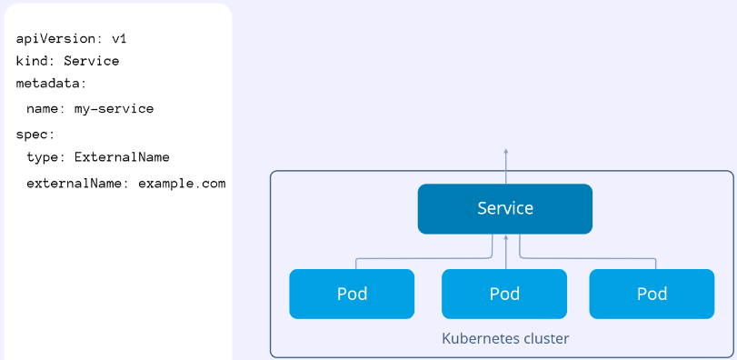
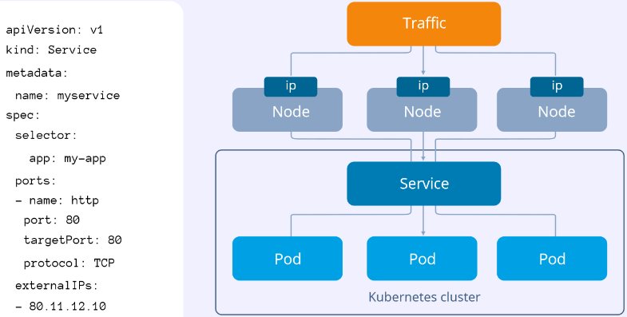
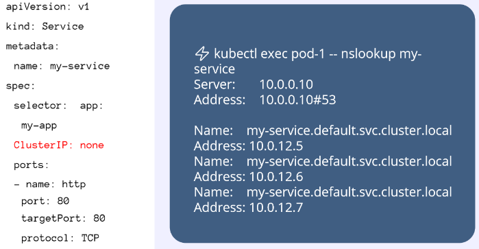

# Урок 6: Сетевые абстракции. Probes
- [Запись](https://www.youtube.com/watch?v=OmTYdf_uDeQ) на youtube
- [Презентация](https://github.com/Slurmio/school-dev-k8s/blob/main/lecture/6.Network_abstractions.pdf) лекции в [github репозитории](https://github.com/Slurmio/school-dev-k8s) школы

## Освежаем знания по базовым абстракциям [00:00:16](https://youtu.be/OmTYdf_uDeQ?t=16)

### Pod
- В kubernetes минимальная абстракция - это не контейнер, а pod
- Pod может состоять минимум из 2х контейнеров
    - один контейнер - это непосредственно рабочая нагрузка, внутри запущено наше приложение
    - второй контейнер - так называемый служебный контейнер, он держит в себе сетевой неймспейс, [процесс pause](https://stackoverflow.com/questions/48651269/what-are-the-pause-containers), его мы особо не касаемся на практике
- Более того, сама абстракция pod тоже служебная, запуская свое приложение с помощью пода мы ставим себя в очень неудобное положение, т.к. лишаем себя гибкости а также двух важных вещей в контексте управления приложением:
    - первое - это обновление приложения, допустим, у нас вышла новая версия приложения, нам нужно каким-то образом сделать рестарт пода, чтобы он пересоздался, и на уровне пода это неудобно
    - второе - это уменьшение/увеличение количества реплик то есть скейлинг - все приходится делать вручную, это неудобно
- Таким образом, pod это служебная абстракция, на её уровень приходится спускаться, когда дело касается какого-то дебага, например, посмотреть логи

### ReplicaSet [00:03:16](https://youtu.be/OmTYdf_uDeQ?t=196)
- Эта абстракция с помощью которой достаточно удобно можно приложение скейлить
- На уровне репликасетов мы можем удобно, централизовано, с помощью одной команды увеличивать и уменьшать количество реплик одного приложения, это здорово, это хорошо и решает одну из двух таких ключевых задач по управлению нашим приложением - скейлинг
- Но с помощью репликасетов неудобно обновлять наше приложение, нам приходится все равно руками как-то там лезть, в общем неудобно, поэтому репликасетами мы тоже не пользуемся, это тоже, скорее, служебная абстракция, ею пользуемся наверное еще реже даже чем подом, потому что это прям совсем такая служебная-служебная, отвечает она только за управление скейлингом

### Deployment [00:04:17](https://youtu.be/OmTYdf_uDeQ?t=257)
- Это действительно та абстракция с помощью которой можно запускать приложение, это действительно так, потому что deployment решает две вот эти самые задачи управления приложением - управления репликами и обновления вашего приложения, все можно делать с помощью деплоймента, всё описывается в yaml манифесте, всё управляется с помощью kubectl, всё достаточно удобно

## Про вступление [00:04:45](https://youtu.be/OmTYdf_uDeQ?t=285)
- Вот это небольшое вступление к теме было нужно, потому что помимо этих двух задач, обновление приложения и скейлинг, есть еще ряд задач, которые не менее важны
- Одна из этих задач - это понимать, а действительно ли приложение которое сейчас запущено в кластере, оно работает и с ним все хорошо
    - Это очень хороший вопрос, очень важный вопрос, нам нужно понимать что действительно, трафик, который идет на наше приложение, он там обрабатывается и с ним всё хорошо
- Может быть такое чисто технически, что приложение висит, процесс как бы есть, он с PID 1 где-то в контейнере крутится, но по факту функциональность не осуществляется, то есть приложение не работает, это может быть случай, например, какого нибудь дедлока, и чтобы такие моменты контролировать kubernetes нам предлагает такое решение как пробы, это возможность как раз понимать, что происходит с приложением, действительно ли оно работает, действительно ли оно готово принимать трафик и действительно ли оно запустилось
- Для такого контроля у нас есть три вида этих проб - это лайвнес проба, рединес проба и стартап проба

## Probes [00:07:09](https://youtu.be/OmTYdf_uDeQ?t=429)
- Синоним хелсчеков
- Позволяют проверять, что приложение действительно работает

### Liveness Probe [00:07:19](https://youtu.be/OmTYdf_uDeQ?t=439)
- Контроль за состоянием приложения во время его жизни
- Исполняется постоянно, с заданной периодичностью
- Если такая проверка будет провалена, то приложение (под) будет перезапущено

### Readiness Probe [00:08:06](https://youtu.be/OmTYdf_uDeQ?t=486)
- Проверяет, готово ли приложение применять трафик
- В случае неудачного выполнения приложение убирается из балансировки, соответственно, после этого в данный инстанс приложения перестанет идти трафик
- Исполняется постоянно, с заданной периодичностью

### Startup Probe [00:09:10](https://youtu.be/OmTYdf_uDeQ?t=550)
- Проверяет, запустилось ли приложение вообще
- Исполняется при старте, остальные типы проверок начнут выполнятся после завершения проверки данного типа

### Переходим в консоль [00:14:07](https://youtu.be/OmTYdf_uDeQ?t=847)
- Работаем в каталоге `~/school-dev-k8s/practice/7.network-abstractions/1.probes`
- Смотрим манифест деплоймента:
```yaml
---
# file: practice/1.kube-basics-lecture/4.resources-and-probes/deployment-with-stuff.yaml
apiVersion: apps/v1
kind: Deployment
metadata:
  name: my-deployment
spec:
  replicas: 2
  selector:
    matchLabels:
      app: my-app
  strategy:
    rollingUpdate:
      maxSurge: 1
      maxUnavailable: 1
    type: RollingUpdate
  template:
    metadata:
      labels:
        app: my-app
    spec:
      containers:
      - image: quay.io/testing-farm/nginx:1.12
        name: nginx
        ports:
        - containerPort: 80
        readinessProbe:
          failureThreshold: 3
          httpGet:
            path: /
            port: 80
          periodSeconds: 10
          successThreshold: 1
          timeoutSeconds: 1
        livenessProbe:
          failureThreshold: 3
          httpGet:
            path: /
            port: 80
          periodSeconds: 10
          successThreshold: 1
          timeoutSeconds: 1
          initialDelaySeconds: 10
        startupProbe:
          httpGet:
            path: /
            port: 80
          failureThreshold: 30
          periodSeconds: 10
        resources:
          requests:
            cpu: 10m
            memory: 100Mi
          limits:
            cpu: 100m
            memory: 100Mi
...
```
- Probes описываются в спецификации внутри контейнеров
- Для каждого контейнера своё описание probes
- Рассматриваем настройки probes
    - readinessProbe
        - failureThreshold
            - допустимое количество проваленных попыток подряд, прежде чем приложение будет выведено из балансировки
            - применяется для того, чтобы из-за каких-то небольших проблем, например с сетью, приложение не останавливалось полностью
        - httpGet
            - сама проверка, в данном случае мы идём в корневой локейшн нашего приложения по 80 порту, для проверки, что nginx готов принимать трафик, этого достаточно
            - успешными считаются коды ответа в диапазоне от 200 до 399
                - например, 301 - это ОК, а 400, 404 - уже не ОК
            - помимо httpGet есть еще проверки:
                - exec
                    - с помощью неё мы можем выполнить внутри контейнера какую-то команду, например, если это база данных, мы можем выполнить SELECT 1, таким образом убедиться, что БД поднялась и готова принимать запросы
                - tcpSocket
                    - это самая простая проверка, которая позволяет проверять TCP сокет, стучаться в него, если он открыт и работает - значит проверка прошла, всё ОК
        - periodSeconds
            - означает, с какой периодичностью выполнять проверку
        - successThreshold
            - сколько успешных проверок сбросит счётчик failureThreshold
        - timeoutSeconds
            - ограничение на время выполнения проверки, собственно, таймаут
    - livenessProbe
        - большинство настроек аналогичны описанным выше
        - initialDelaySeconds
            - отсрочка выполнения первой проверки, использовали до появления startupProbe
    - startupProbe
        - основное отличие от предыдущих проверок - большие значения, т.е. мы даём сервису 5 минут на запуск
- При выводе k get pod, в колонке READY выводится результат readinessProbe
- Если сходить в логи пода, развёрнутого из этого манифеста деплоймента, можно увидеть информацию о запросах probes к нашему nginx

## Способы публикации [00:28:32](https://youtu.be/OmTYdf_uDeQ?t=1712)
- Как опубликовать приложение, запущенное в кластере kubernetes, чтобы клиенты, находящиеся вне кластера, могли получить к нему доступ?
- Как настроить внутрикластерное взаимодействие своих приложений, фронтенда, бэкенда?
- Унас есть 2 абстракции, с помощью которых можно решать данные задачи, о них ниже

### Service [00:29:23](https://youtu.be/OmTYdf_uDeQ?t=1763)
- Ключевые моменты почти для всех сервисов
    - Важно, чтобы селектор совпадал с лейблами подов
    - Поды и сервисы должны находиться в одном неймспейсе
- ClusterIP [00:29:42](https://youtu.be/OmTYdf_uDeQ?t=1782)
    - Используется для того, чтобы наладить внутрикластерное взаимодействие частей приложения (например, связать фронтенд с бэкендом)
    - В теории, можно отказаться от использования данного сервиса и работать с IP адресами подов, передавать их, например, через переменые окружения, но это будет работать до тех пор, пока поды не начнут перезапускаться и, соответственно, менять адреса
    - Также, с помощью данного сервиса мы можем пробрасывать приложение через kubectl port-forward на хост, с которго запускается данная команда, это удобно для разработки или отладки. Таким образом удобно работать с зависимостями, можно обращаться к тем компонентам кластера, которые требуются в данный момент
        - Команда `kubectl port-forward service/my-service 10000:80` пробросит 80 порт сервиса my-service на 10000 порт хоста, с которого запускается эта команда
        - Раньше подобное можно было делать командой kubectl proxy, но сейчас этот метод считается устаревшим
- NodePort [00:34:22](https://youtu.be/OmTYdf_uDeQ?t=2062)
    - [Документация](https://kubernetes.io/docs/concepts/services-networking/service/#nodeport)
    - Позволяет опубликовать приложение наружу, для этого он и используется, правда, с оговорками
    - Может публиковать приложение только на определённом диапазоне портов, по умолчанию это 30000-32767
    - При необходимости можно явно указать нужный порт в манифесте
    - Создаёт на каждой ноде кластера соответствующее правило трансляции
    - Подходит для использования, если есть внешний балансировщик, в котором можно указать соответствие
    - Может использоваться для работы с LoadBalancer [00:38:09](https://youtu.be/OmTYdf_uDeQ?t=2289)
    - [00:46:43](https://youtu.be/OmTYdf_uDeQ?t=2803) Реальный кейс применения NodePort - переносили монолитные приложения, их пилили на микро сервисы, затаскивали всё в kubernetes, получалось что часть приложения в монолите, а часть приложения в kubernetes, при этом есть некий центральный nginx, который часть трафика продолжает отправлять на монолит, а часть трафика отправляет уже в kubernetes, на порты, опубликованные наружу через NodePort. Например, \<url>/api отправляли в kubernetes а \<url>/cabinet отправляли еще в монолит и вот таким образом можно решать подобные проблемы
- LoadBalancer [00:38:20](https://youtu.be/OmTYdf_uDeQ?t=2300)
    - Тип LoadBalancer используется, преимущественно, у облачных провайдеров и как раз этот тип сервиса нам позволяет действительно легко и прозрачно предоставлять доступ извне кластера к нашему приложению
    - Данный тип сервиса используется преимущественно в облаках, потому что у облачных провайдеров есть контроллер, например openstack контроллер, который постоянно смотрит в kubernetes и контролирует создание сервисов типа LoadBalancer и когда данный тип сервиса создается в кластере, контроллер у себя создает балансировщик, например elastic LoadBalancer, и трафик отправляется в этот балансировщик и уже соответственно с этого балансировщика отправляются внутрь кластера на наше приложение
    - И вот этот балансировщик, он создается контроллером и если контроллера нет, соответственно, нет функциональности, которая позволяет смотреть в API кубернетеса и контролировать создание сервисов типа LoadBalancer, то никакой магии не произойдет и сервис типа LoadBalancer не будет работать, то есть, на bare metal по умолчанию это не работает, он просто будет висеть
    - Но в VK Cloud это будет работать, поэтому всё хорошо, единственное у нас всё-таки кластер немного кастомизирован и всё такое, поэтому могут всплыть некоторые особенности
    - Вообще, в облаках это работает, это очень удобно, более того, есть возможность в манифесте указать  конкретный статический IP адрес, который будет использоваться как входная точка в ваш балансировщик
    - LoadBalancer отлично подходит чтобы опубликовать свое приложение и в том числе TCP, например, если надо выставить наружу кластера какой-нибудь postgres или rabbitmq, то LoadBalancer отличный вариант, но с учётом того, что работает это в облаках
- ExternalName [00:40:58](https://youtu.be/OmTYdf_uDeQ?t=2458)
    - 
    - Позволяет создать алиас для DNS имени в качестве имени сервиса
    - Посмотрите внимательно на стрелки, если раньше у нас стрелки шли от сервиса к поду, то теперь это происходит немножко наоборот и это не ошибка это специфика работы этого сервиса
    - Когда мы создаем вот такой сервис, как видите, он достаточно минималистичный, создается правило и создается dns-запись и, в таком случае, когда мы из пода обращаемся по имени сервиса, например через `curl my-service` или `nslookup my-service` то мы по факту попадаем на example.com, адрес который мы прописали в поле ExternalName, то есть, это некая такая хитрая переадресация
    - Сложно придумать кейсы где это можно действительно применить, потому что обычно ничто не мешает сразу же из пода напрямую обращаться к example.com, но это может быть, к примеру, какой то закрытый продукт где вы ничего не можете править и вам нужно там что-то поменять или какие-то значения в приложении захардкожены и вам нужно их сменить
- ExternalIPs [00:42:39](https://youtu.be/OmTYdf_uDeQ?t=2559), технические шоколадки и повтор с [00:44:58](https://youtu.be/OmTYdf_uDeQ?t=2698)
    - 
    - Если вы посмотрите на схему то увидите, что тут почти то же самое что и у сервисов NodePort, только вместо портов здесь указаны IP
    - Схема того как работает сервис типа ExternalIPs очень похожа на то, как работает сервис типа NodePort, c тем исключением, что в NodePort у нас создается правило трансляции которые работают с каким-то конкретным портом, а в ExternalIPs у нас создается правило которое работает с IP адресом
    - Когда мы создаем сервис ExternalIP, у нас на каждой ноде кластера создаются правила трансляции и трафик, приходящий на IP адрес, указанный в этом поле, будет пробрасываться в наше приложение.
    - Кластер kubernetes такой умный и понимает где именно этот IP адрес находится? Не понимает и это не очень удобно
    - Один из примеров применения данного сервиса - у нас есть какой-то внешний балансировщик и есть какой-то виртуальный IP-адрес (VIP) или, как принято говорить, протокол VRRP, keepalived настроен, допустим наш VIP изначально находится на первой ноде, вдруг с ней что-то произошло и тогда keepalived по VRRP этот адрес переносит на вторую ноду и мы можем быть уверены что на этой ноде все необходимые правила трансляции тоже есть, то есть, трафик будет приходить и сразу попадать в нужный под
- Headless [00:47:58](https://youtu.be/OmTYdf_uDeQ?t=2878), техническая заминка и повтор с [00:50:56](https://youtu.be/OmTYdf_uDeQ?t=3056)
    - 
    - Этот сервис не про внутрикластерное взаимодействие и не про публикацию, поэтому он немножко так особняком стоит
    - Отличительной особенностью Headless сервиса является то что у него не указан ClusterIP (см. слайд)
    - Для такого сервиса не будет создан IP адрес, но будет создана DNS запись, которая будет отдавать IP адреса всех подов для этого сервиса
    - Используя данную DNS запись мы также можем обращаться напрямую к подам
        - Будет выглядеть примерно так: my-app-1.my-headless-service.my-cluster.my-zone
    - Данный сервис используется в конкретном случае, а именно со StatefulSet
        - [00:53:30](https://youtu.be/OmTYdf_uDeQ?t=3210) StatefulSet является заменой деплойменту для stateful приложений, например баз данных, эта тема будет рассмотрена в следующих лекциях
        - У подов в StatefulSet имена подов формируются добавлением номера в конце, таким образом, можно настроить репликацию, чтобы отправлять запросы на чтение в slave, а запросы на запись в master, определяя, какой запрос куда отправлять, опираясь на имена подов и DNS запись, сформированную headless сервисом

### Практика [00:54:13](https://youtu.be/OmTYdf_uDeQ?t=3253)
- Работаем в каталоге `~/school-dev-k8s/practice/6.network-abstractions/2.ingress-and-services`

#### Разбираем сервис ClusterIP
- Смотрим на манифест сервиса ClusterIP
    ```yaml
    apiVersion: v1
    kind: Service
    metadata:
      name: my-service  # имя сервиса
    spec:
      ports:
      - port: 80        # порт, на котором сервис будет принимать трафик
        targetPort: 80  # порт, на который сервис будет перенаправлять трафик
      selector:
        app: my-app     # значение метки, по которой селектор будет производить выборку
      type: ClusterIP   # тип сервиса
    ```
    - В данном случае тип сервиса указан, но если тип не указывать, то по умолчанию будет использоваться ClusterIP
    - Важно корректно указывать имя сервиса, т.к. на его основе будет создана DNS запись в кластере kubernetes
    - В селекторе мы описываем метки, по которым будут выбираться поды, чтобы перенаправлять на них трафик
- Чтобы наш трафик все-таки в какое-то приложение отправлялся, давайте запустим наше приложение:
    ```shell
    > kubectl create -f app
    
    deployment.apps/my-deployment created
    Error from server (AlreadyExists): error when creating "app/configmap.yaml": configmaps "my-configmap" already exists
    ```
    - Т.к. configmap уже существует, можно добиться нужного результата удалив созданные сущности, например через `kubectl delete -f app/` и затем повторив создание через команду `kubectl create -f app/`
    - Также можно выполнить `kubectl apply -f app/`
    - Если вдруг кто забыл, у нас есть две возможности создавать что-то в кластере kubernetes из файла
        - С помощью `kubectl create` и тогда объект в кластере создастся, если его ещё не было, а если этот объект уже был в кластере с этим именем, то он там не создастся
        - С помощью `kubectl apply` мы можем эти объекты конфигурировать, то есть если `kubectl apply -f` применить на какой-то объект, если этого объекта в кластере еще нет, то он создастся а если он уже есть, то сконфигурируется
- Посмотрим что у нас всё действительно запустилось:
    ```shell
    > kubectl get pod
    
    NAME                             READY   STATUS    RESTARTS   AGE
    my-deployment-5f979b576b-6shcg   1/1     Running   0          20m
    my-deployment-5f979b576b-mc4r6   1/1     Running   0          20m
    ```
- Чтобы лучше разобраться с ClusterIP, давайте воссоздадим соответствующие условия
- Мы развернули nginx, допустим что это приложение с каким-то фронтендом
- Запустим тестовое приложение, мы будем обращаться к основному приложению из этого пода с помощью установленных в нём утилит, таких как curl, nslookup
    ```shell
    kubectl run test --image=centosadmin/utils:0.3 -it bash
    ```
- Мы можем узнать IP адрес пода с приложеним и постучаться по нему с помощью curl из пода с утилитами и получить ответ, но это будет работать до тех пор, пока под с приложением работает, как только под переедет или будет перезапущен, адрес изменится и такая возможность пропадёт
- Создаём сервис из манифеста, рассмотренного выше и посмотрим к чему это приведет
    ```shell
    > kubectl apply -f clusterip.yaml
    
    service/my-service created
    
    > kubectl get svc
    
    NAME         TYPE        CLUSTER-IP       EXTERNAL-IP   PORT(S)   AGE
    my-service   ClusterIP   10.254.115.220   <none>        80/TCP    2m48s
    ```
- При создании сервиса происходит следующее:
    - Ему присваивается некий IP адрес из заранее определенного пула (у нас кластере kubernetes есть как минимум два пула адресов, для подов и для сервисов и они не должны пересекаться)
    - В DNS кластера kubernetes создаётся DNS запись которая по имени сервиса будет отправлять нас в поды нашего приложения
- Итак, сервис создан, ему были присвоены IP адрес и DNS запись
- Не забываем про то, что сервис работает с подами используя селектор и метки на подах, они должны совпадать, смотрим что это так:
    ```shell
    > kubectl describe svc my-service | grep Selector

    Selector:          app=my-app

    > kubectl get pod --show-labels
    
    NAME                             READY   STATUS    RESTARTS   AGE   LABELS
    my-deployment-5f979b576b-6shcg   1/1     Running   0          66m   app=my-app,pod-template-hash=5f979b576b
    my-deployment-5f979b576b-mc4r6   1/1     Running   0          66m   app=my-app,pod-template-hash=5f979b576b
    test                             1/1     Running   1          26m   run=test
    ```
- Таким образом, сервис в рамках неймспейса будет перенаправлять запросы к нему на поды с соответствующей меткой
- Теперь мы можем снова зайти в наше под с утилитами и попробовать повзаимодействовать через сервис с nginx который запущен в нашем деплойменте 
    - Мы можем взять и использовать IP адрес сервиса, который мы видели выше в столбце CLUSTER-IP
        ```shell
        > kubectl exec -it test -- bash
        # тут мы провалились в под с утилитами и будем дёргать адрес балансироващика сервиса

        > curl 10.254.115.220

        my-deployment-5f979b576b-6shcg

        > curl 10.254.115.220

        my-deployment-5f979b576b-mc4r6
        ```
- Видим что всё работает,  у нас две реплики нашего приложения, отдается то один хостнейм, то другой, работает это рандомно, как подбрасывание монетки
- Но адрес сервиса тоже может смениться, хотя шанс этого и меньше
- Вспоминаем, что вместе с сервисом создаётся DNS запись, которая соответстует названию сервиса и не будет меняться, пока не изменится сам сервис, а если IP адрес сервиса изменится, то DNS запись обновится, это то что нам нужно, проверяем
    ```shell
    # мы всё ещй в поде с утилитами и теперь будем дёргать уже имя сервиса

    > curl my-service

    my-deployment-5f979b576b-6shcg

    > curl my-service

    my-deployment-5f979b576b-mc4r6
    ```
- Вспоминаем 12 factor app, конфигурирование приложений через переменые окружения, мы просто прописываем имена сервисов в переменных окружения, куда-то в db_host, frontend_host, во что нибудь такое и больше не заморачиваемся, вообще никаких айпи адресов, сервис-discovery у нас целиком лежит на kubernetes
- Удаляем за собой под с утилитами, он нам больше не нужен
    ```shell
    > kubectl delete pod test

    pod "test" deleted
    ```
- В рамках одного неймспейса мы можем обращаться к приложению через сервис указывая просто имя сервиса
- Eсли нужно обратиться к приложению в другом неймспейсе, то после имени сервиса через точку указываем имя неймспейса, вот так: `my-service.my-namespace`

#### Разбираем сервис NodePort [01:09:48](https://youtu.be/OmTYdf_uDeQ?t=4188)
- Смотрим в манифест:
    ```yaml
    apiVersion: v1
    kind: Service
    metadata:
      name: my-service-np
    spec:
      ports:
      - port: 80
        targetPort: 80
      selector:
        app: my-app
      type: NodePort
    ```
    - Отличительная особенность - указание типа, а именно NodePort
    - Также мы можем явно указать порт ([документация](https://kubernetes.io/docs/concepts/services-networking/service/#nodeport))
    - Всё остальное как у ClusterIP
- Пробуем применить манифест, получаем ошибку:
    ```shell
    > kubectl apply -f nodeport.yaml

    # часть ошибки не видна за аватаром ведущего, в момент написания конспекта ошибки уже не было
    Error from server (Forbidden): error when creating "nodeport.yaml": services "my-service-np" ...
    : exceeded quota: resource-quota, requested: service:nodeports=1, used: services.nodepo...
    services.nodeports=0
    ```
    - Учебный кластер готовили неглупые люди, ранее об этом упоминалось, есть инструменты администрирования кластера, это возможность обезопасить и себя и разработчиков от ошибок человеческого фактора, если мы приняли решение что в кластере нельзя создавать какой-то тип объекта или  объектов определённого типа должно быть ограниченное количество, то с помощью таких абстракций как ресурс квоты и лимит ренджи мы можем это достаточно жестко регламентировать
    - Вот прекрасный пример, мы захотели сервисов с типом NodePort в количестве 1, но у нас лимит на сервисы с типомNodePort в размере 0
- Ограничения сняты, пробуем применить манифест ещё раз:
    ```shell
    > kubectl apply -f nodeport.yaml

    service/my-service-np created
    ```
- Смотрим на сервисы:
    ```shell
    > kubectl get svc

    NAME            TYPE        CLUSTER-IP       EXTERNAL-IP   PORT(S)        AGE
    my-service      ClusterIP   10.254.115.220   <none>        80/TCP         102m
    my-service-np   NodePort    10.254.240.139   <none>        80:32405/TCP   18m
    ```
- Видим наш сервис, ему выданы IP адрес и DNS имя, которые работают так же как и в случае с сервисом типа ClusterIP
- Мы видим у нашего сервиса порт с номером больше 30000
- Если мы обратися на адрес любой ноды в кластере на этот порт, то мы будем перенаправлены на наше приложение
    ```shell
    > kubectl get nodes -o wide | (head -1 && tail -1)

    NAME                                      STATUS   ROLES    AGE   VERSION   INTERNAL-IP   EXTERNAL-IP       OS-IMAGE         KERNEL-VERSION                CONTAINER-RUNTIME
    kubernetes-cluster-8675-master-2          Ready    master   36d   v1.20.4   10.0.0.5      213.219.212.215   CentOS Linux 8   4.18.0-305.7.1.el8_4.x86_64   docker://19.3.15

    # а это уже с личного ПК
    > curl 213.219.212.215:32405

    my-deployment-5f979b576b-6shcg

    > curl 213.219.212.215:32405

    my-deployment-5f979b576b-mc4r6
    ```
    - Это еще один повод запретить бездумное использование сервиса типа NodePort, потому что вот таким образом мы на всех эндпоинтах, на всех внешних IP адресах нашего кластера взяли и выставили свое приложение наружу, в реальности там мог бы быть дашборд какой-то или внутренняя система аутентификации или еще что-то, что могло бы послужить для хакеров входной точкой в наш проект, поэтому вполне логично, что подобные вещи надо как-то регламентировать, но это уже ближе к    администрированию

Остановился здесь [01:15:21](https://youtu.be/OmTYdf_uDeQ?t=4521)

### Ingress #ToBeContinued 